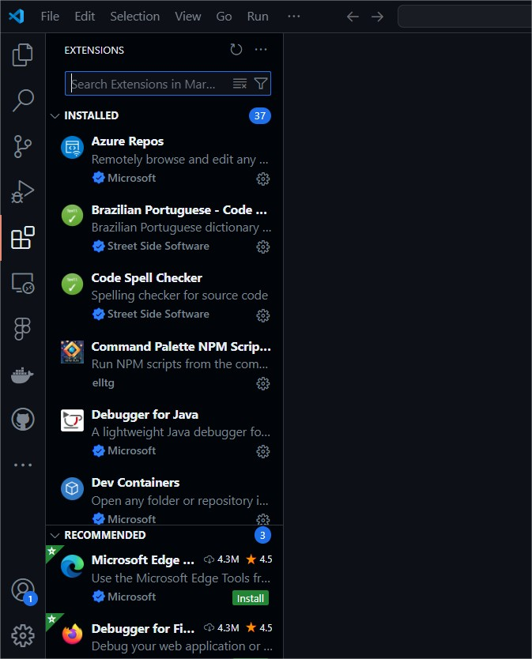

# VSCode
O Visual Studio Code (VSCode) é um editor de código-fonte (não é uma IDE) gratuito e de código aberto, desenvolvido pela Microsoft, projetado para diversas linguagens de programação. Ele combina simplicidade, desempenho e extensibilidade, tornando-se uma das ferramentas mais populares entre programadores.

## Características do VSCode

1. **Extensões e Personalização**: vasta gama de extensões no marketplace e interface altamente customizável com temas e atalhos. Configure o Settings Sync para fazer backup das suas configurações
2. **Depurador Integrado**: possui ferramentas robustas para depuração de código diretamente no editor.
3. **Git e Controle de Versão**: possui integração nativa com Git  
4. **IntelliSense**: autocompletar inteligente  
5. **Terminal Integrado**: Terminal embutido para executar comandos diretamente no editor. 
6. **Live Share**: possibilita a colaboração em tempo real com outros desenvolvedores.
7. **Interface Amigável**: Design intuitivo e leve, ideal para iniciantes e profissionais.
8. **Suporte a Linguagens**: compatível com várias linguagens de programação.
9.  **Comunidade Ativa**: Grande comunidade que desenvolve extensões e fornece suporte.
10. **Leve e rápido**: quando comparado a outras IDES
11. **Docker**: Suporte a desenvolvimento remoto e Docker.

## Extensões

Extensões interessantes e úteis no VSCode:

### [Code spell Checker](https://marketplace.visualstudio.com/items?itemName=streetsidesoftware.code-spell-checker)
Um corretor ortográfico básico que funciona bem com códigos e documentos. Importe o [Brazilian Portuguese - Code Spell Checker](https://marketplace.visualstudio.com/items?itemName=streetsidesoftware.code-spell-checker-portuguese-brazilian). 

### [Prettier](https://marketplace.visualstudio.com/items?itemName=esbenp.prettier-vscode)
Na tentativa de resolver [Tabs x Spaces](https://www.youtube.com/watch?v=oRva7UxGQDw), Prettier é um formatador de código opinativo.

Comandos:
1. `Ctrl + Shift + P` -> Format Document 
2. Selecione o texto -> `Ctrl + Shift + P` -> Format Selection

### [Docker](https://marketplace.visualstudio.com/items?itemName=ms-azuretools.vscode-docker)
A extensão Docker facilita a criação, o gerenciamento e a implantação de aplicativos em contêineres

### Dev Containers
A extensão Dev Containers permite que você use um contêiner Docker como um ambiente de desenvolvimento completo, de forma isolada e portátil. Utiliza um arquivo .devcontainer para configurar automaticamente o ambiente do contêiner, incluindo dependências, extensões e configurações específicas.

### Extensões de Controle de Versão
* [Github Pull Requests](https://marketplace.visualstudio.com/items?itemName=GitHub.vscode-pull-request-github): permite que você revise e gerencie solicitações de pull e problemas do GitHub
* [Github repositories](https://marketplace.visualstudio.com/items?itemName=GitHub.remotehub): permite que você navegue, pesquise, edite e faça commit rapidamente em qualquer repositório remoto do GitHub.
* [Github Actions](https://marketplace.visualstudio.com/items?itemName=GitHub.vscode-github-actions): permite que você gerencie seus fluxos de trabalho, visualize o histórico de execução do fluxo de trabalho e ajuda na criação de fluxos de trabalho.
* [Git Blame](https://marketplace.visualstudio.com/items?itemName=solomonkinard.git-blame): Uma extensão simples com hover inline opcional ou status blame, equivalente do comando `git blame`, usado para indicar quem alterou uma linha. 📸
* [Git lens](https://marketplace.visualstudio.com/items?itemName=eamodio.gitlens): criada pelo Git Kraken, aprimora fluxos de trabalho com funcionalidades avançadas do Git, como anotações e hovers personalizáveis. Já possui GitBlame embutido.

### AI
* [GitHub Copilot](https://marketplace.visualstudio.com/items?itemName=GitHub.copilot): é uma ferramenta de programador de par (*pair programming*) de IA que ajuda você a escrever código de forma mais rápida e inteligente. Gratuito para estudantes e professores pelo pacote [Github Student Developer Pack](https://education.github.com/pack).

* [GitHub Copilot Chat](https://marketplace.visualstudio.com/items?itemName=GitHub.copilot-chat): formato de chat para o Copilot

### [WSL (Windows)](https://marketplace.visualstudio.com/items?itemName=ms-vscode-remote.remote-wsl)
A extensão WSL permite que você use o VSCode no Windows para criar aplicativos Linux que são executados no Subsistema Windows para Linux (WSL).

### Requests
* [Rest Client](https://marketplace.visualstudio.com/items?itemName=humao.rest-client)
O cliente REST permite que você envie solicitações HTTP e visualize a resposta diretamente no Visual Studio Code.
* [Postman](https://marketplace.visualstudio.com/items?itemName=humao.rest-client)
Permite que você desenvolva e teste suas APIs no Postman diretamente do Visual Studio Code. Você pode usar a extensão do VSCode para criar e enviar solicitações HTTP, Raw WebSocket e gRPC.

### [Live Share](https://visualstudio.microsoft.com/pt-br/services/live-share/)
Compartilhe seus códigos e colabore com qualquer coisa, em qualquer lugar, a qualquer momento

### [Figma for VSCode](https://marketplace.visualstudio.com/items?itemName=figma.figma-vscode-extension)
permite que você navegue e inspecione arquivos de design, colabore com designers, rastreie alterações e acelere a implementação - tudo sem sair do seu editor de texto.

### [GitHub Theme para VSCode](https://marketplace.visualstudio.com/items?itemName=GitHub.github-vscode-theme)
Disponibiliza alguns temas, incluindo os de alto contraste, para o VSCode.

### [SonarQube for IDE](https://marketplace.visualstudio.com/items?itemName=SonarSource.sonarlint-vscode)
SonarQube for IDE da Sonar é uma extensão IDE gratuita que permite que você corrija problemas de codificação antes que eles existam. Mais do que um linter, o SonarQube for IDE detecta e destaca problemas que podem levar a bugs, vulnerabilidades e code smells conforme você cria seu código.

### [ESLint](https://marketplace.visualstudio.com/items?itemName=dbaeumer.vscode-eslint)
O ESLint analisa estaticamente seu código para encontrar problemas rapidamente. Ele é integrado à maioria dos editores de texto e você pode executar o ESLint como parte do seu pipeline de integração contínua.

## Configurações no VSCode

### Backup e sincronização das configurações do VSCode
No 1º semestre de 2022, O VSCode passou a permitir backup das suas configurações e sincronização com o servidor do GitHub. Siga as instruções do link https://code.visualstudio.com/docs/editor/settings-sync e ative isto, agora você nunca mais perderá suas configurações e ainda poderá sincroniza-las com outros computadores.

### Modo de salvamento de arquivos
Ative-a clicando em File e depois em Auto Save no menu.

### Selecionar qualquer texto no terminal ao selecionar com mouse
Ative a opção: "terminal.integrated.copyOnSelection": true

## Outras dicas

### [React Developer Tools](https://chromewebstore.google.com/detail/react-developer-tools/fmkadmapgofadopljbjfkapdkoienihi)
Adiciona ferramentas de depuração do React às Ferramentas do desenvolvedor do Chrome.

Para outros navegadores, veja [React Developer Tools](https://pt-br.react.dev/learn/react-developer-tools).

 